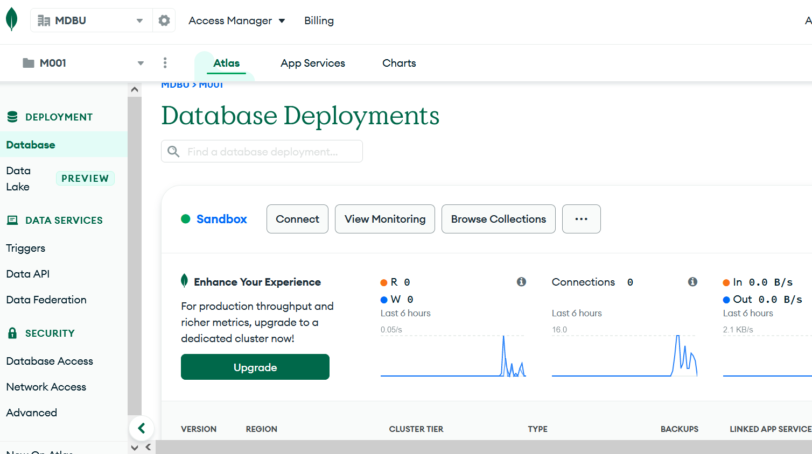
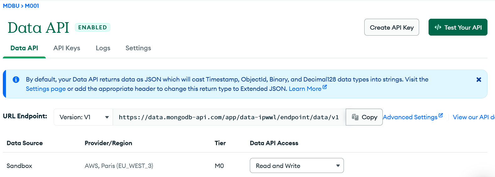
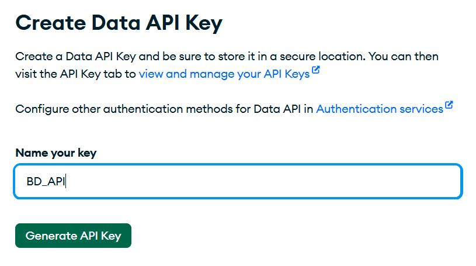
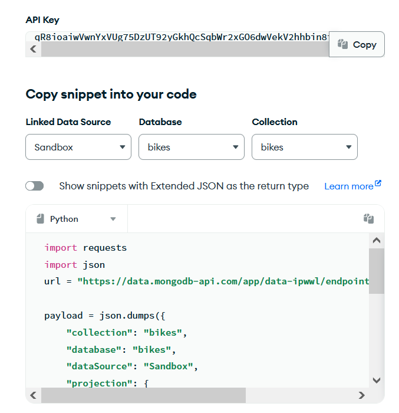
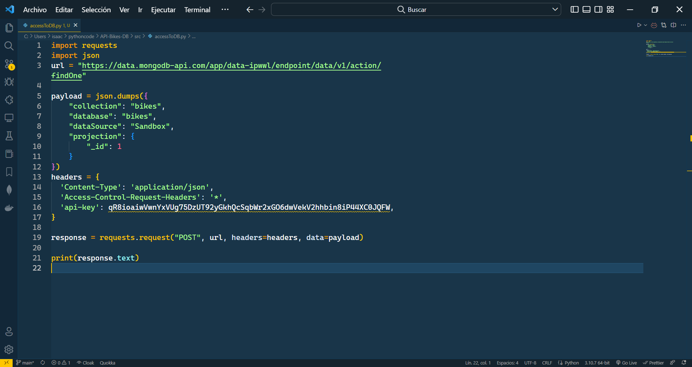
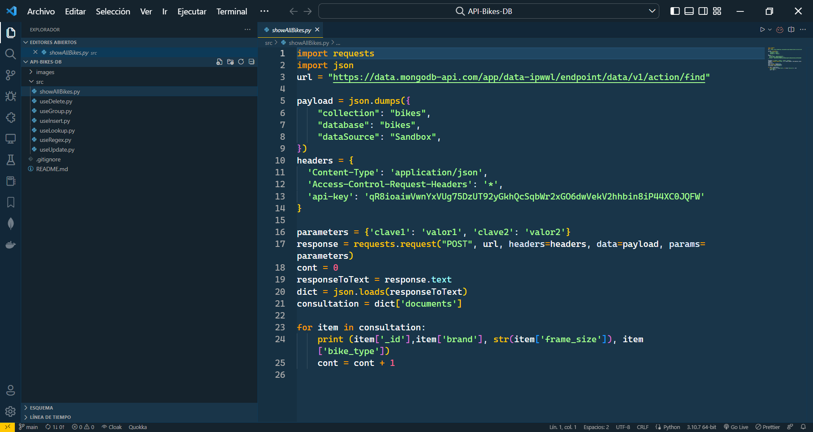

# API-Bikes-DB

## Connect to the Atlas web interface and follow the API link  

Once inside our Atlas interface, in the left menu we will find a section called "Data services", inside this menu is Data API, which is where we will click to enter the API creation page.  

  

## Create an API key  

Now that we have followed the link in the previous step, we must create the API, the first thing we must do is go to the right side of the page, where we will find a button that says "Create API Key". We must click on it.  

The first step is to name the API Key.

### Choose database and collection

Once the name is set, we must ***select the cluster, the database and the collection that we want to use*** in the API Key. 

### Change cURL to Python

We must also ***specify the programming language*** in which we want to get the data API, in our case ***Python***.

## Paste the cURL on VS Code

Now we simply copy and paste the data given to us. We have pasted them in the VS Code:

## Modify the code

En esta sección explicaremos lo que hemos hecho con la cURL proporciada. Hemos hecho varios ejemplos:

- Show all the bikes
- Delete one bike
- Use the aggregate pipeline ***$group***
- Insert one bike
- Use the aggregate pipeline ***$lookup***
- Find with $regex
- Update a document

### Show all the bikes

