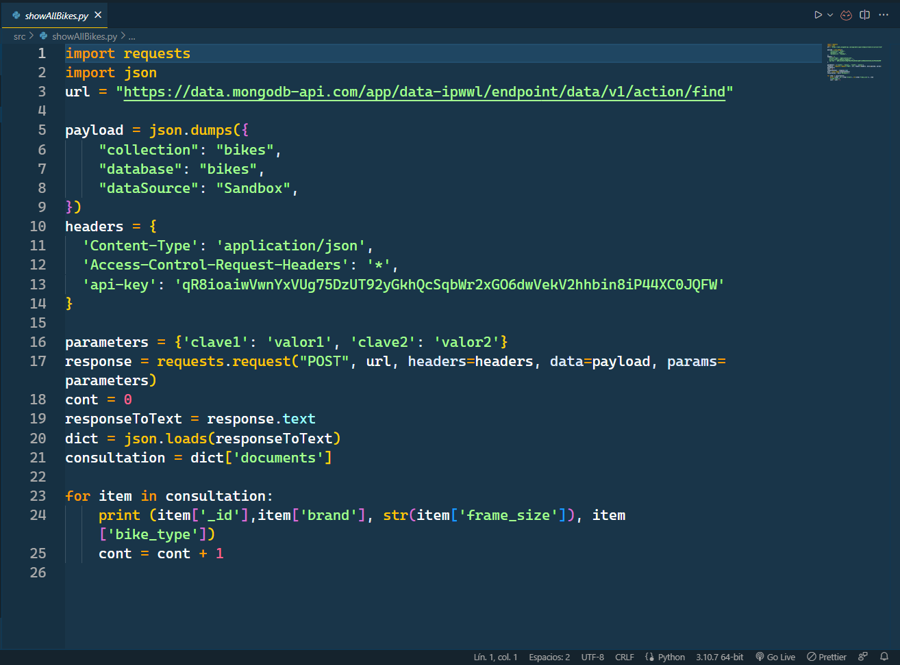
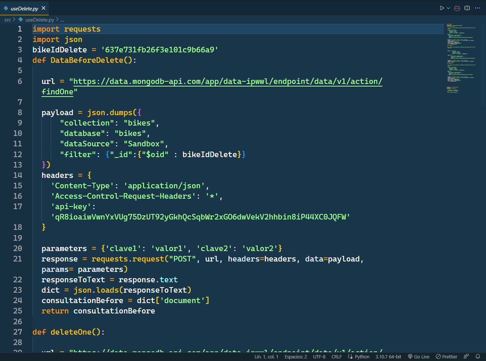
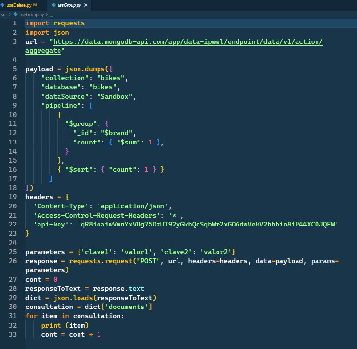
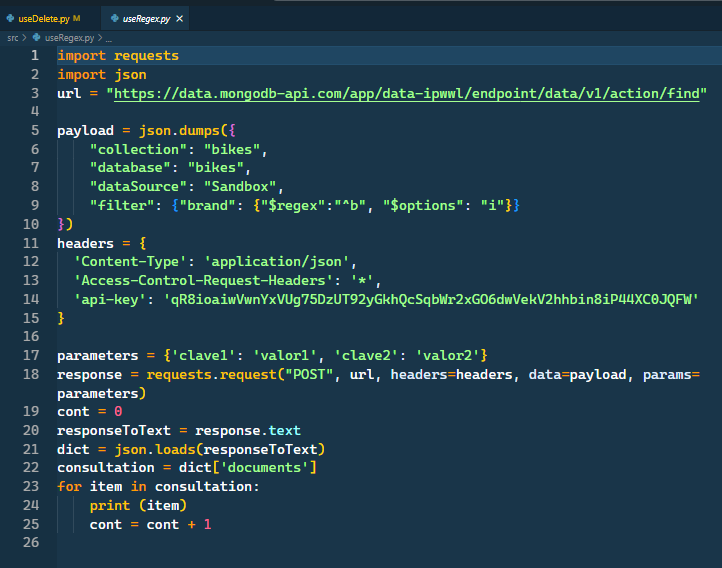

# API-Bikes-DB

## Connect to the Atlas web interface and follow the API link  

Once inside our Atlas interface, in the left menu we will find a section called "Data services", inside this menu is Data API, which is where we will click to enter the API creation page.  


## Create an API key  

Now that we have followed the link in the previous step, we must create the API, the first thing we must do is go to the right side of the page, where we will find a button that says "Create API Key". We must click on it.  


The first step is to name the API Key.


### Choose database and collection

Once the name is set, we must ***select the cluster, the database and the collection that we want to use*** in the API Key. 

### Change cURL to Python

We must also ***specify the programming language*** in which we want to get the data API, in our case ***Python***.


## Paste the cURL on VS Code

Now we simply copy and paste the data given to us. We have pasted them in the VS Code:


## Modify the code

In this section we will explain what we have done with the provided cURL.   

We have made several examples:

- Show all the bikes
- Delete one document
- Use the aggregation pipeline ***$group***
- Use the aggregation pipeline ***$lookup***
- Insert one document
- Find with $regex
- Update a document

### Show all the bikes

To be able to show all the bikes what we have done has been, first, to change the endpoint, in which it says findOne, we change it to only find, so that it shows us more than one document. Then we added some parameters so that it saves the values in a dictionary. Once the query is done, we pass the text that is in json format to str. From str we pass it to dictionary, then we take all the data that are inside the dictionary.

Once we have all the data we want in the dictionary, we make a for loop to print all the bicycles of the collection on the screen.



This is what it prints:


### Delete one document

This is the code we have used to delete a document, it is longer than any other because we wanted it to tell us if we have deleted the document or not.

First of all, we have created a variable with the id of the document we would like to delete. 

Then we define a function in which we make a query to the database and what it does is to save the state of the database before deleting the document.



This is the second function of the code, the one we use to delete the desired document. To carry out the operation we have changed, again, the endpoint, now we have put deleteOne. 

In the code below we can see that in ```"filter"``` we put "$oid" to indicate that what we are using is of type ObjectID.

```
  payload = json.dumps({
              "collection": "bikes",
              "database": "bikes",
              "dataSource": "Sandbox",
              "filter": {"_id":{"$oid" : bikeIdDelete}}
          })
```


Finally, we have a function that will save the state of the database after deleting the document.


Now what we do is to compare the state of the database before deleting the document and after. If they are not the same it means that the document has been successfully deleted.


### Use the aggregation pipeline "$group"

Now we are going to use the aggregation pipeline, the first thing we have done has been to change the endpoint as in the previous ones, since it is another type of operation, this is aggregate. the only thing that changes in this type of queries is that instead of putting "filter", as we saw in the previous point, we must put "pipeline". Within this, we must put what we want to do, in our case we put a group, a count, to add up how many times each group comes out and a sort at the end to sort in ascending order by the number of groups it contains.



Here we can see an example of how the data is displayed on the screen:


### Use the aggregation pipeline "$lookup"

In this one we do the same, we use aggregate and pipeline. Inside we do lookup as we normally do and that's it. :+1:


Here we can see an example of how the data is displayed on the screen:


### Insert one document

To insert a document what we did was, first, to change the endpoint to insertOne, then, to declare a variable for each field of the document that we want to insert. What we have to do next, is to change where before we put pipeline, now we will put document. Inside this same one we will add with the fields that we want and we will put the variables assigned before as value.


### Find with $regex

Now what we will do is to search for files with regex, which searches for a letter or a pattern of characters in the database.

First, the endpoint must be find.

Then we must put filter instead of pipeline, inside filter we put regex and options, what options does is that it lets you choose if you want it to be caseSensitive (s) or caseInsensitive(i).



Here is the result of the consultation made with this program:


### Update one document

Lastly, we use the update function.

The first thing we did was to initialize two variables, the first to indicate the current value of the field and the second to indicate the new value.

We must change the endpoint to update. We continue using filter, but we change the content inside, now we simply put the field and the value that we want to change. Then we put update with the new value of the field.

## Conclusion

In our opinion, after having used Pymongo and the API, we liked Pymongo better, because once you are inside the database you can do all these operations without having to change the endpoint constantly, it would be much less lines of code, and also faster, because every time you want to make a query with the API, you have to reconnect to the database, in the case of Pymongo, you connect once and until you tell it to go out, it will not go out. 

in the final analysis:  
Pymongo :fire:  
API :shit:

